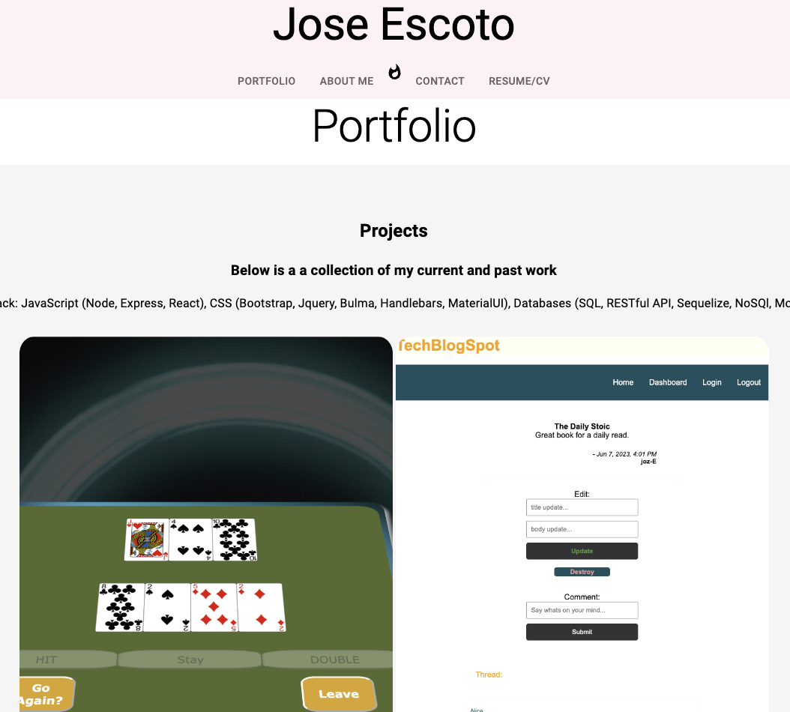

# React Portfolio 

## Description

Personal Portfolio to display current projects and contacts. 

## Table of Contents

- [License](#License)
- [Future](#Future)
- [Credits](#Credits)
- [Contact](#Contact)

## License

License: MIT License

## Credits

Jose Escoto, Full Stack Development Student, University of Berkeley.

## Contact

For more questions please contact below:
Email: j.escoto@gmail.com
GitHub: [escotoj](https://github.com/escotoj)

reactportfolio.png

### TODO

- form input must show alert when nothing entered and proper email must be required, make it send you an email.  
- aboutme - needs a avatar photo and background info 
- mobile responsive navbar and projects
- colors theme 

### DONE

- add a link to download CV or view it on google docs. 
- add two more projects
- portfolio/projects - page
- contact page with a form. - page 
- Add function to navbar links. 
- footer icons
- images to top projects
- move header to top of navbar
- about me - page
- Resume/background - page

npx create-react-app 

